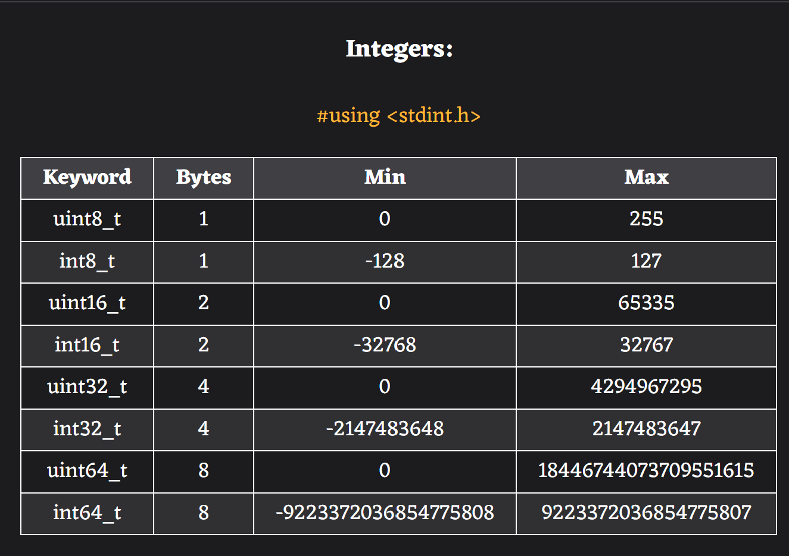
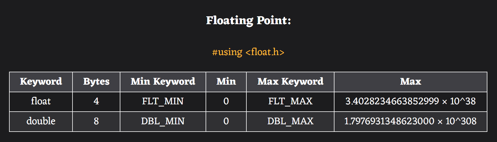
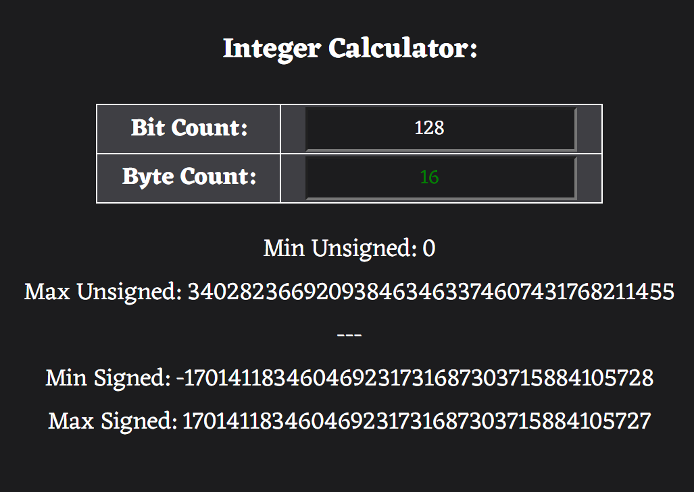
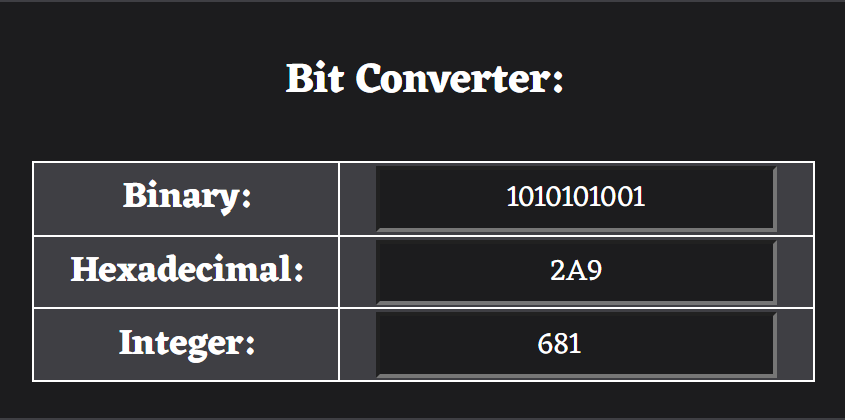
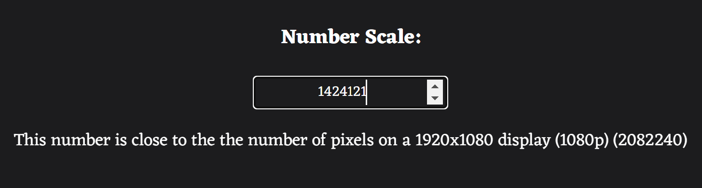
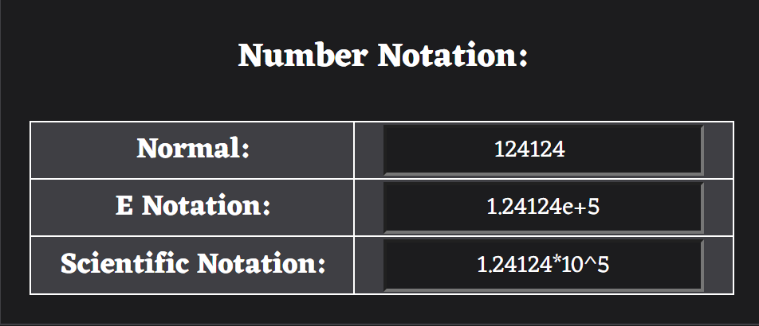

# ByteTools
#### A collection of tools for dealing with binary data, particularly related to C.

---

### C Integers
The sizes of standard C integers, their mins and maxes.

### C Floating Points
The sizes of standard C floats, their mins and maxes.

### Integer Calculator
Calculate the hypothetical mins and maxes of integers with any bit counts.

### Bit Converter
Convert to and from binary, hexadecimal, and integers.

### Number Scale
Put numbers into scale by comparing them to values in our universe.

### Notation
Convert numbers to and from normal notation, e notation, and scientific notation.

